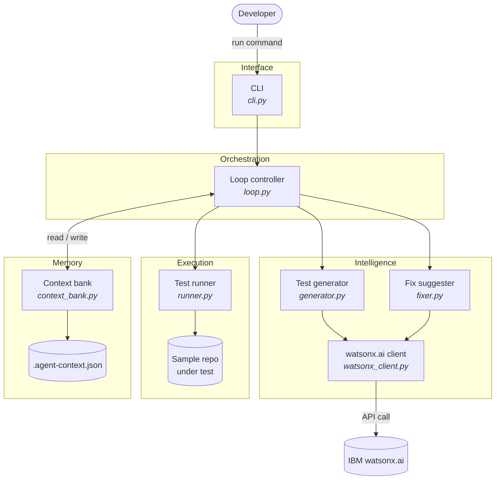
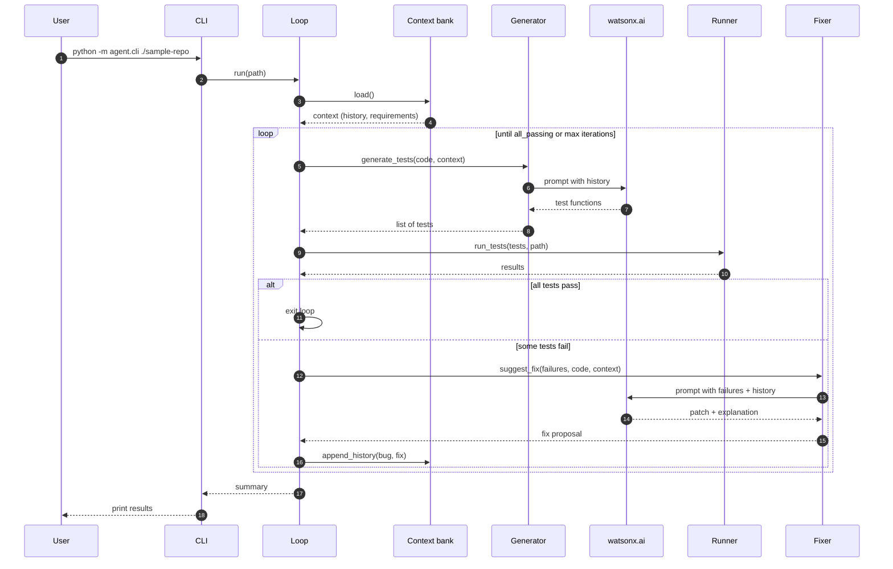
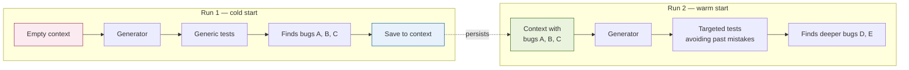
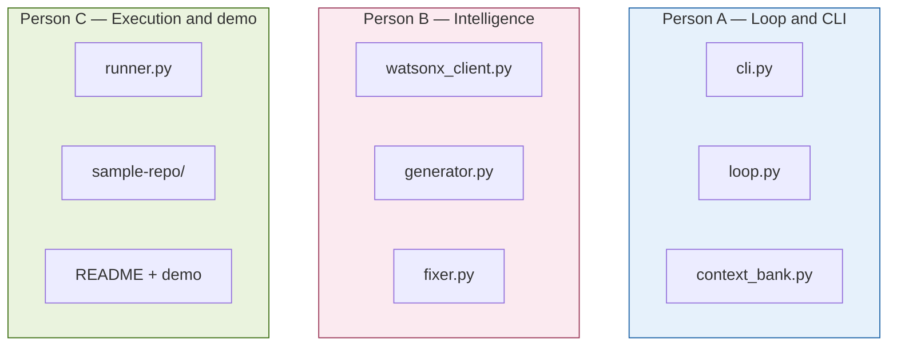
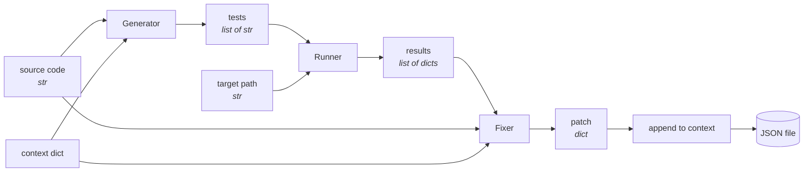
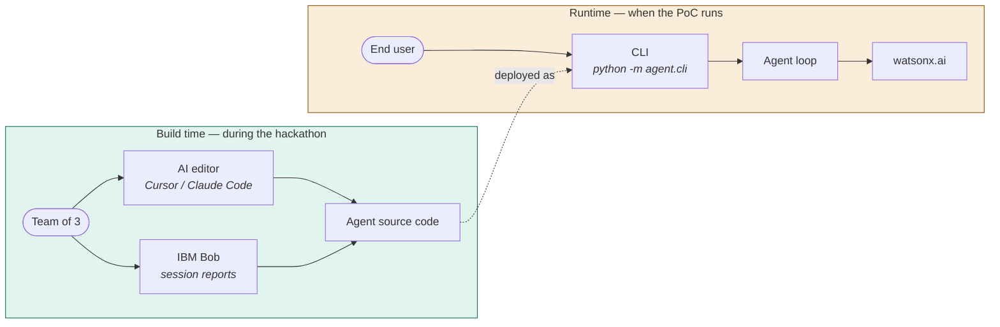

# Architecture Diagrams — Recursive Testing Agent

This file contains the architectural views for the project. All diagrams use [Mermaid](https://mermaid.js.org/), which renders natively on GitHub, GitLab, VS Code (with the Markdown Preview Mermaid Support extension), and Obsidian.

Keep this file at the repo root as `ARCHITECTURE.md` so AI editors and teammates can reference it.

---

## 1. High-level architecture

The full system at a glance: who calls what, where intelligence comes from, and where memory lives.

**Key idea:** `Loop controller` is the only module that orchestrates. Every other module is a pure function that takes input and returns output. The `Context bank` is read **before** each step and written **after** each iteration.

---

## 2. Recursive loop sequence

What happens during a single run of the CLI, step by step.

**Key idea:** the loop is the *recursive* part. Each iteration's bugs and fixes are appended to the context bank, so the next iteration's prompts include that history.

---

## 3. The differentiator — what makes run 2 different from run 1

This is the diagram to point at during the demo. It shows why the persistent context bank matters.

**Key idea:** without the context bank, run 2 would repeat run 1. The persistence is what turns this from a test generator into an agent that learns your codebase.

---

## 4. Module ownership

Who owns what during the hackathon. Useful for stand-ups and merge conflict resolution.

**Key idea:** dependencies between modules cross owner boundaries. That's why the shared contracts in `CONTRACTS.md` matter — each person works against the contract, not against another person's half-finished code.

---

## 5. Data flow — what travels between modules

The actual shape of the data passed at each edge. Useful when debugging integration issues.

**Key idea:** all interfaces use plain Python types — strings, lists, dicts. No custom classes. This is intentional for a PoC: it makes mocking trivial during Sprint 1 and keeps each module debuggable on its own.

---

## 6. Build-time vs runtime

Often confused. The AI editor and IBM Bob are tools used **during the hackathon** to write the agent's code. They are **not** part of the running product. Once the PoC is built, only the CLI and watsonx.ai matter.

**Key idea:** three different AI systems, three different roles, do not mix them when explaining to judges:

| Tool | Role | When it runs |
|---|---|---|
| **AI editor** (Cursor / Claude Code) | Writes the Python code of the agent | Build time only |
| **IBM Bob** | Development partner; session reports prove how you built it | Build time only |
| **watsonx.ai** | Reasoning engine inside the agent (generates tests, suggests fixes) | Runtime |

The product is the **CLI**. The AI editor disappears once the hackathon ends.

---

## Tips for using these diagrams with your AI editor (during the hackathon)

These tips apply while the team is **writing** the agent — they're for your Cursor / Claude Code / Copilot sessions, not for the running product.

- **Paste this whole file** as project context when starting a new AI editor session. The diagrams disambiguate what each module is supposed to do better than prose alone.
- **Reference diagrams by number** in prompts: "based on the sequence in section 2, implement `loop.run`".
- **Update diagrams as you go.** If the implementation drifts from the diagram, fix the diagram in the same PR. Stale diagrams are worse than no diagrams.
- **For the final demo,** export each diagram as PNG (in VS Code: right-click on the rendered preview, save as image). Drop them into your slides.
